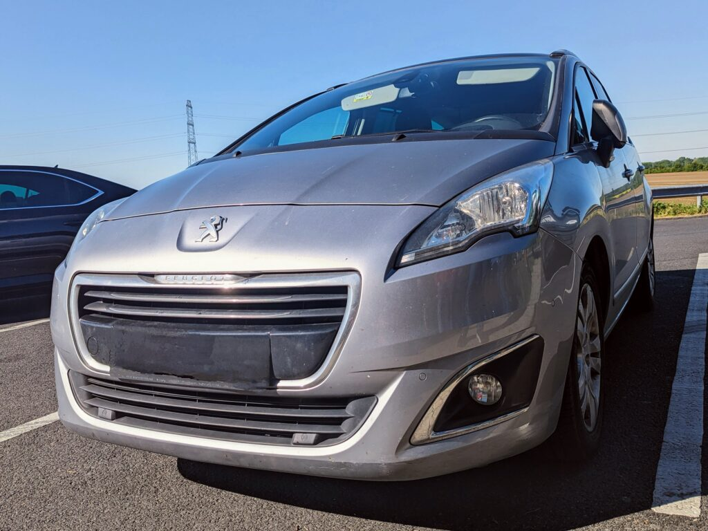
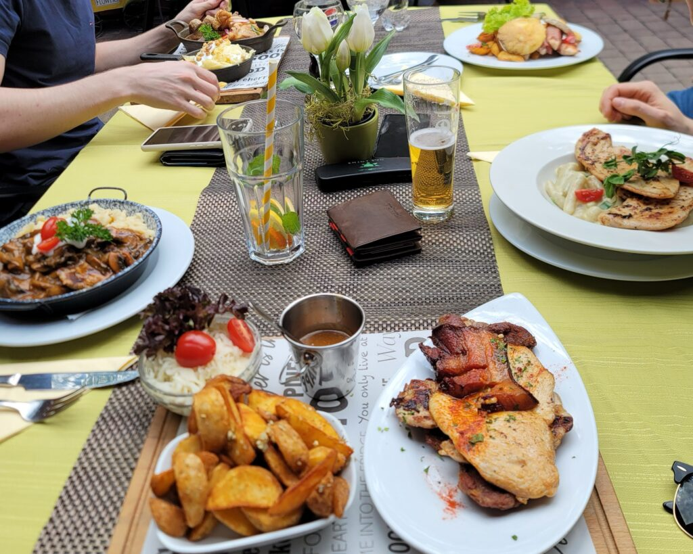
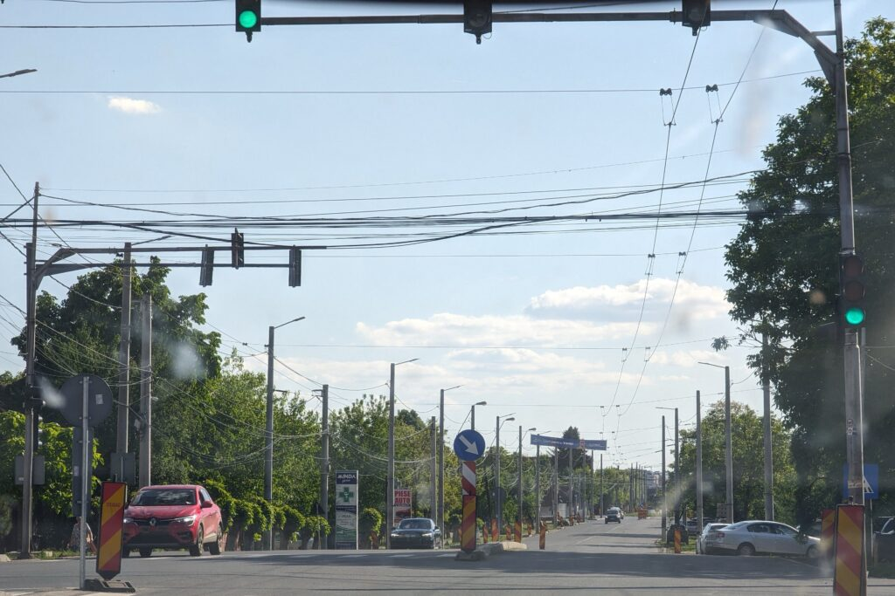
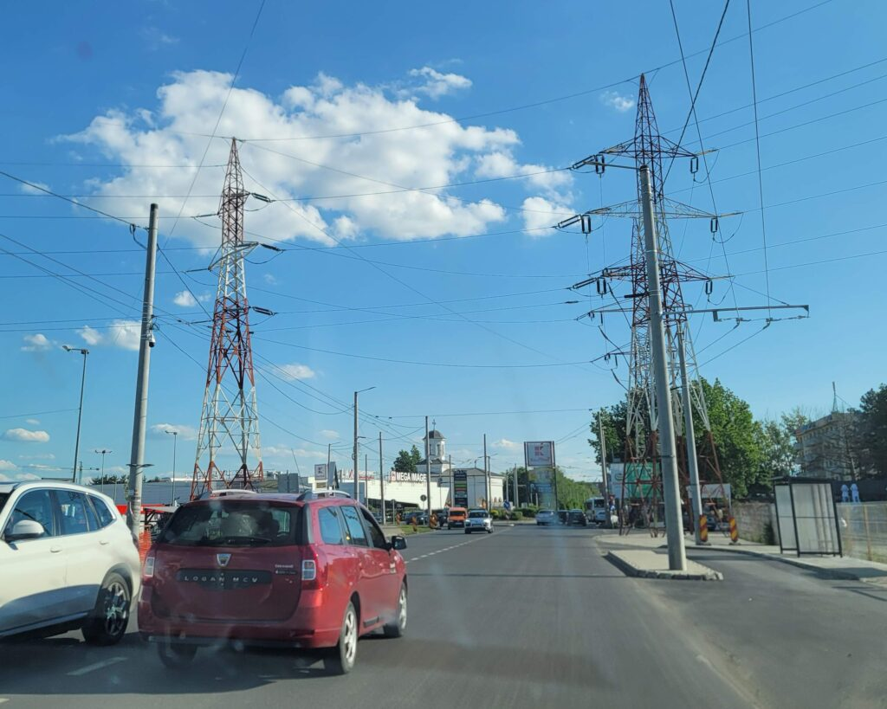
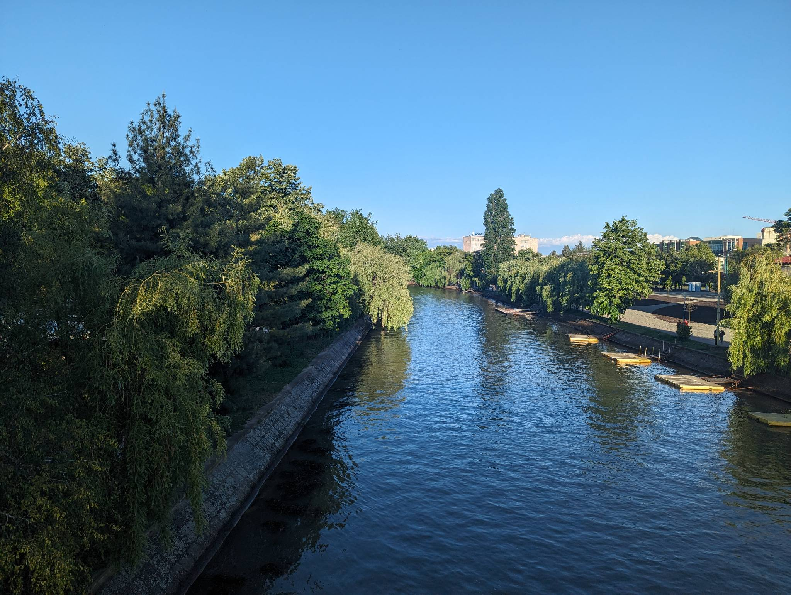
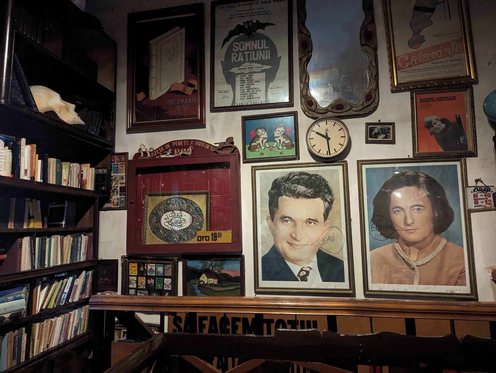
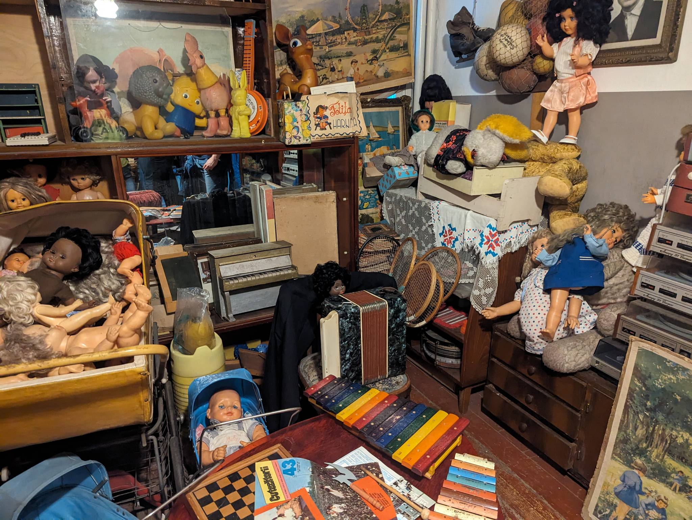
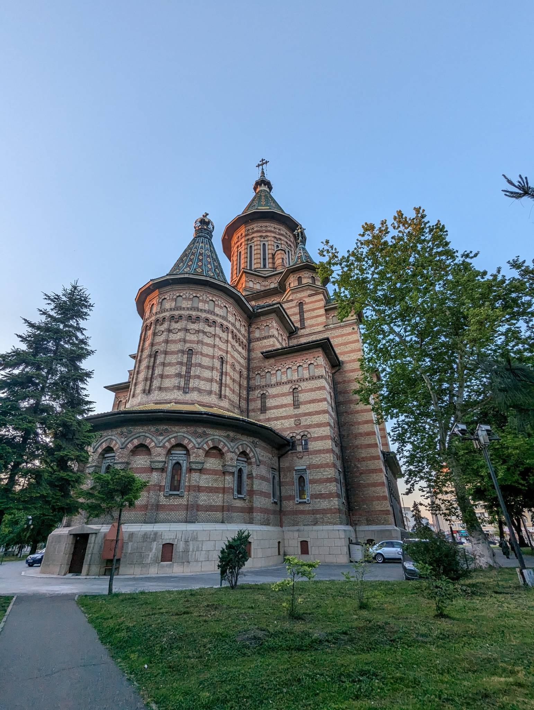

Day 1 begins, but before that, let’s go back 8 hours. 10 PM. The discounted Chinese food we ordered finally arrived. We ordered two chicken noodles, fried bananas and spring rolls. The dishes were exquisite given their price. I was really surprised by how good the food was, since it was twice as cheap as anything else on Glovo. And so my stomach was full, and I was ready to go to sleep. But sleep I would not. First of all, since we did not have enough beds, onbe of us would have to sleep in a sleeping bag - unfortunately on the ground. It was me, who volunteered to be the martry. And so we went to sleep. I had finally found a comfortable sleeping position, when my friend started snoring, loudly. After 30 minutes I still wasn’t asleep. So I was forced to move to another room. There I was actually able to fall asleep, but only after trying several sleeping positions.

And it was morning. I felt like I had just fallen asleep. I barely started dreaming, but apparently, it was already 6 o’clock. Well, it will have to do, I thought. 2 or 3 hours of sleep should be enough. And to be fair, as I am writing this right now in the afternoon, I am not sleepy just yet. In any case, we packed the luggage and readied ourselves for a multi-hour journey.

*The car in perfect condition for our trip*

The first stop was in Hungary. First we stopped at a rest station to consume some sandwiches with cheese and salami. And after that another stop at a gas station to get some drinks. The next stop in Hungary, however, was a bit longer. We stopped to eat some lunch. The lunch was absolutely delicious. We ordered various different dishes - chicken wrapped in bacon with a side of potato wedges and grilled cheese, grilled chicken and some other dishes. Unfortunately I do not remember the other dishes. Mine was so good, that I simply forgot about the other dishes.

*The table was full of exquisite dishes*

And after our stomachs were full, we headed towards Romania. Not long after we stumbled upon a long line of cars - we were in front of the border. Cars, buses and trucks, they were all waiting to enter the country of Romania. Fun fact, since Romania is not entirely in the Schengen area. This means, that we had to present our documents after crossing the border. Additionally we didn’t need a passport, which is really nice, since some of my friends do not have a passport. 10 or 15 minutes after, we were across the border and on our way to the city of Timisoara.

Just twenty minutes before arriving at our destination, there was a huge Jesus statue signifying that we were getting close to the town of Timisoara. The statue made us wonder, what religion is most prominent in Romania. We all made our guesses, but Google told us that it is the Orthodox religion. About 78% of people in Romania are Orthodox according to a quick Google search that I did.

And soon after entering the city itself, it was immediately clear that we were in Romania. There were cables everywhere. Usually the electricity tends to be run underground in the bigger cities around Europe, but in Romania it is all above ground. This is an approach that can often work. Thinking about Japan, outside of cities, there were electricity poles everywhere. However, the electricity network is well managed and the poles really didn’t look bad or were inconvenient or dangerous in any way. Here in Romania, the story is a little different on the other hand. The cables are everywhere, the poles are often not straight and the cable lines often reach all the way the ground. Literally. When looking at the roadsides and while walking through the city there were multiple times, when the cable lines reached all the way to the ground. I could easily touch them if I wanted to or event cut them. And there were even those huge high voltage power lines in the middle of the city! Honestly, this seems a little bit dangerous to me, but I am guessing that there weren’t enough accidents to make people rethink their ways of building electricity networks in Romania.

*Cables everywhere!*

*High-voltage power lines in the middle of the city!*

However, speaking about the city itself, I really liked it. It felt really chill and lively. The park that we walked through, while on our way to the communist museum, was full of people and we even saw a wedding. What I really loved about this city, were it’s parks and greenery. The river Bega that flows through the city allows small boats to carry passengers through parts of the city. Unfortunately, I could not convince my friends to take a boat ride - they were understandably bored of sitting. The driving took us 11 hours after all.

Having enjoyed some fresh air in the park, we arrived at the communist museum. The museum was full of different items from the past, the communist era - all of them produced in Romania. The place was filled with dishes and silverware that reminded me of the my grandma’s place. There were also old CRT TVs. I haven’t seen one of these in a long time - and I never used one in the first place. In addition to that there were tens of toys, kitchen utensils, tools, postcards, books and so much more. We really were taken to the 60s and 70s.

We finished our day with a visit to the “Three Hierarchs” church. What fascinated me the most about this church was its architecture - especially from the outside. Especially its roof was much different from churches at home. The roof was the shape of a cone. It reminded me of the Romanian castles that I have seen while browsing the internet. We are about to visit one tomorrow, so I will be able to make further comparison’s.

So, this was the first day. Things did go according to the plan for the most part. Except for the drive, it was much longer. 11 hours in total. At first I thought it was 12 hours, but then I realised we switched timezones. Romania (UTC +3) is 1 hour ahead of Slovenia (UTC +2). So yeah, quite a fun day and I am looking forward to more adventures in the following days!
