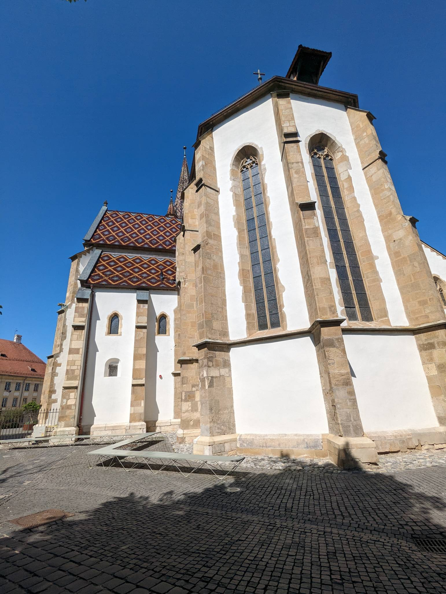
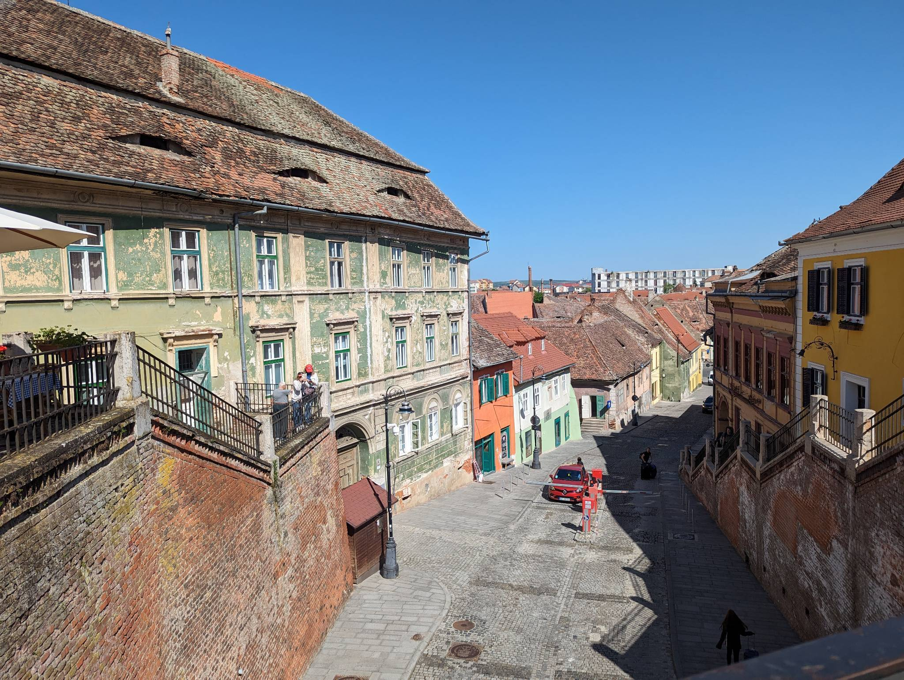
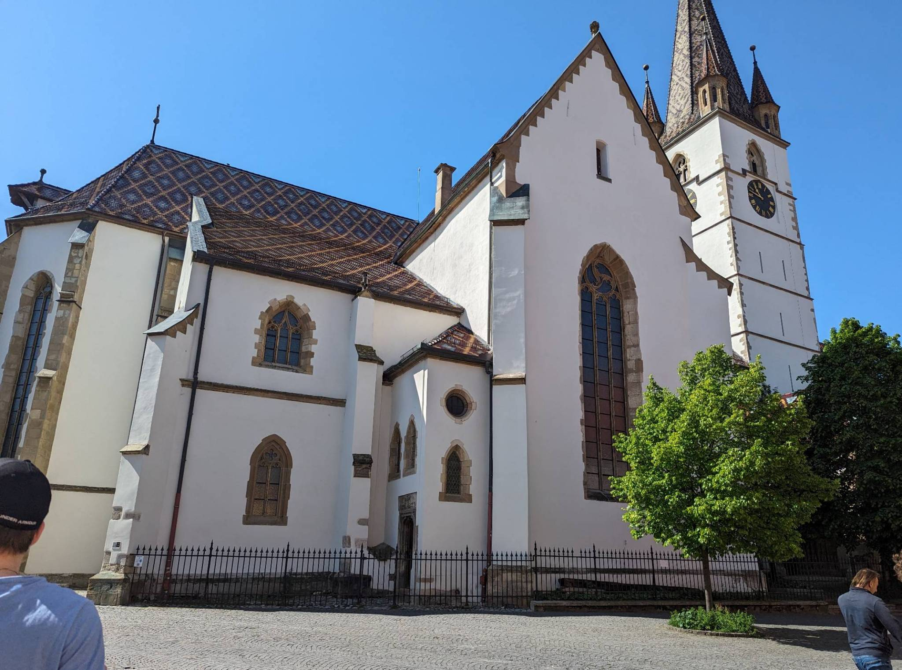
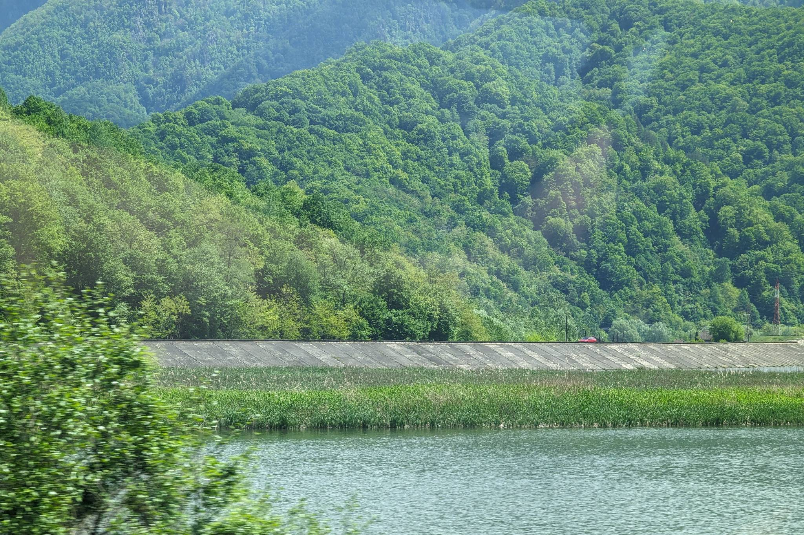
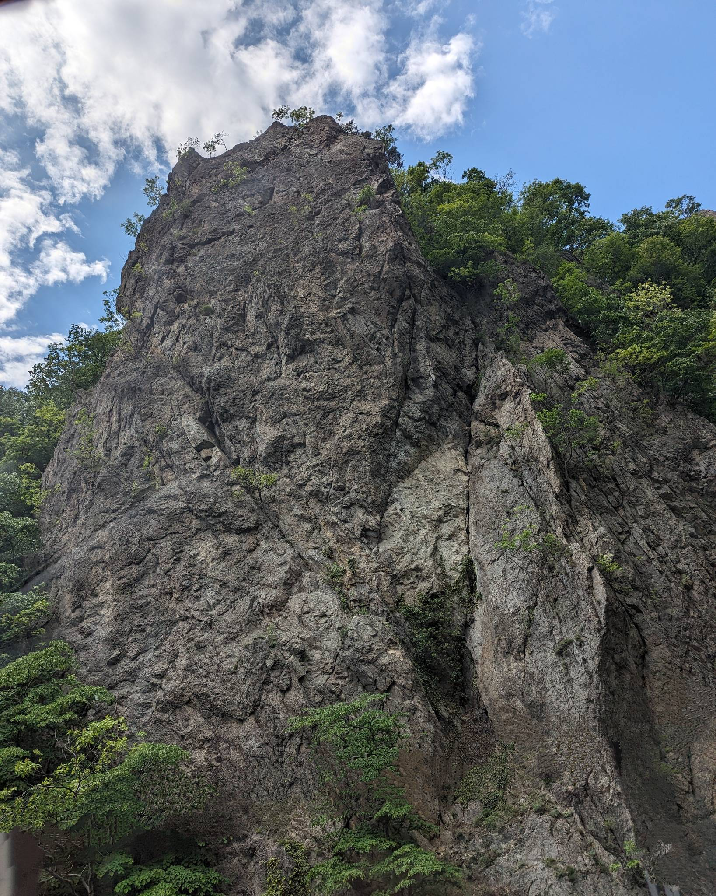

I’m going to be short today, because I am both tired and not a lot has happened today. Everything was either delayed or we had to wait a lot - with the exception of Romanian drivers. They were the ones waiting to pass us on the road. For some reason, even though we were driving slightly above the speed limits, the cars behind us were always faster - we were once even overtaken by a double-trailer truck. It seemed like everyone was in a hurry. But we didn’t let this bother us too much. We just let the cars pass occasionally and everything was fine.

I was unexpectedly woken up by my friends and I was forced to get up and go the dining hall. My booking had an included breakfast, which I found to be great, since eating in the hotels saved us a lot of time. The breakfast was ok, but I wouldn’t give really it a Michelin star. At least I wasn’t hungry for a couple of hours. Soon after, we packed our stuff and left for Sibiu. 

Not long after we arrived in Sibiu - a medieval town with a rich history and many buildings from medieval times. There are remains medieval walls and towers built mainly in the Germanic architecture. This architecture is a legacy of 12th-century Saxon settlers. The town has a nickname: The Town with Eyes because historically, a lot of buildings had open rooftops. The place is also known for its gastronomy and its Christmas market. Additionally, I read that it was a hometown of two renowned scientists - Conrad Haas and Hermann Oberth - 16th and 19th century rocket scientists. With these facts in mind, we started our morning routine with a stop at the coffee shop. The staff there were really nice - we ordered a coffee and I ordered a cup of hot chocolate. We had a little chat about the coffee and where we come from. They were amused by the fact that we come from Slovenia stating, that Slovenia was really nice and green. One of the customers also said that they used to work in Slovenia at Krka (a pharmaceutical company). We shared their amusement and told them that we were enjoying Romania as well. The weather was nice and the interaction made us excited about things to come.

The city was vibrant, full of people and the architecture had a similar feeling. When you take into account its Germanic origins, this of course makes sense. I have been to Germany, Switzerland and Austria before and I got a similar vibe while visiting the towns scattered across these countries. We explored the old city center, bought some souvenirs, some ice-cream and finished our morning drinks.The town center also had a town fair with various food, drink and souvenir stalls and much more. We chilled in the city center for a bit and later headed back to our car.

The road after Sibiu was a breath of fresh air - a valley with a river, surrounded by green lush forests. The hills partially reminded me of my own country, but on certain parts a bit more rocky and steep. The river valley was scattered with ancient artefacts seemingly left there by long lost civilisations, though my friends inform me, that the railway system is quite a modern development. The river flowing through the valley gave the place a serene feeling. And while I was enjoying the views, my friend was having a mental breakdown trying to deal with local Romanian drivers.

We arrived in Bucharest late in the evening. The evening was spent going to a restaurant, getting some food and drinks and later going to a bar and enjoying the Bucharest atmosphere. The city had a similar vibe to the bigger cities of Europe that I have been to (thinking about Paris for example). Just one difference - the drivers were even worse here! Driving here was a nightmare. It was like the road was full of raging bulls - everyone accelerating like crazy and changing lanes without any turn signals. Add to that the fact that the drivers were often aggressive and forced you to yield even though you had the right of way - a crazy driving experience! And that is more or less it for today.
