We woke up late, the night was long and eventful, but I won’t go into details. It was a calm rainy day, perfect for sightseeing and making ourselves a breakfast. We decided not to eat out for once, so we headed to the nearby Mega Image. Mega Image you say? Well, no, it is not a camera equipment shop, it is a grocery store. I woke up earlier than some of my friends and so the three of us who were awake, decided to do the shopping for today. We bought some bread, eggs, bacon and a bottle of orange juice - a filling, tasty breakfast.

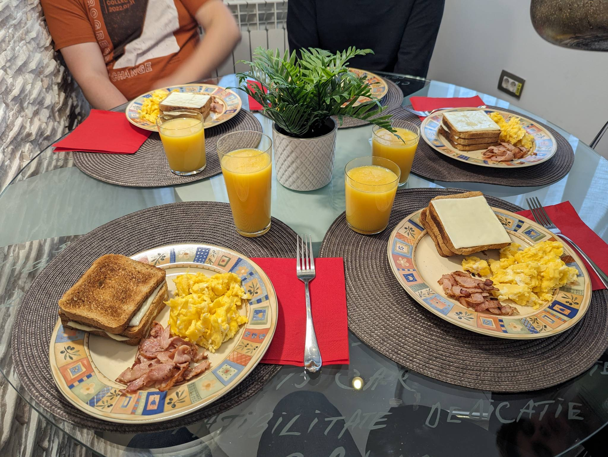

The city tour began with a visit of one of the largest government buildings in the world - the Bucharest parliament. It was built during the dictatorship of Chau Nicolae Ceaușescu, leader of a former communist North Korea like dictatorship. The palace was in fact inspired by the North Korean regime. The parliament building was a part of Project Bucharest that began in 1978 and tried to replicate the North Korean capital, Pyongyang. And I saw a couple more similarities to North Korea - large multi lane roads and communist the flats, both commonly present in Pyongyang. And yet another piece of history that really reminds me of the North Korean regime is the Unirii Bulevardul - a 92 meter wide, 2.8 km long road leading to the front of the palace. The Boulevar was built as an answer to the Parisian Champs-Elysees Boulevard. Construction of the building caused incalculable damage to the historical and architectural heritage of the city. And sadly, this wasn’t the only megalomaniac project built under this repressive regime. The parliament and the boulevard do indeed look majestic, but thousands of people had to suffer for this to become a reality.

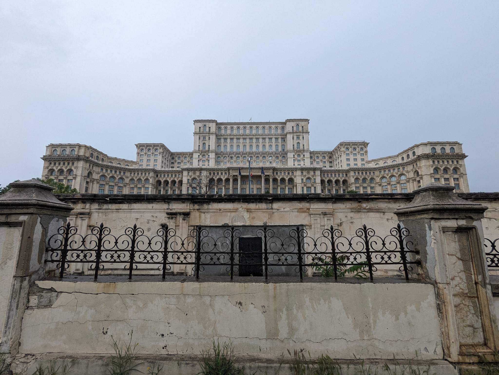

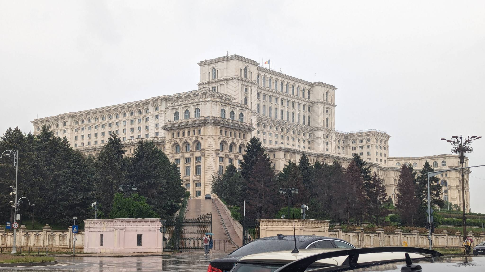

Our visit wasn’t without problems. One of my friends forgot his umbrella and it was raining. Additionally, some of use wanted a snack or a morning drink. Thus, we headed to the city center. We found a really nice place to relax for an hour or two - a 5-storey library. The cellar was dedicated to manga, board games, comics, anime and game merchandise. On the ground level there was a corner with English best-sellers and the first storey had the rest of English books - fiction, biography, etc. The top 2 stories were dedicated to children and there was a cafe. This is where we enjoyed a coffee and/or hot chocolate. Some of us even bought some books - I could not resist the temptation of buying a couple of books. Having recently watched the Shogun series (and I seriously recommend you watch it, it is in my opinion on of the best series), I bought the novel that was the inspiration for this series - Shogun, by James Clavell. Additionally I bought two more books - Great Japanese Stories (a bilingual book, a collection of various Japanese short stories) and Pachinko, by Min Jin Lee. I can’t wait to read the Shogun novel, but it will be a long read - the book has almost 1200 pages. A fine addition to my library of books. And while we were exploring the library, we came across a group of Slovenes. We shared our itineraries and it turned out, they were quite similar.

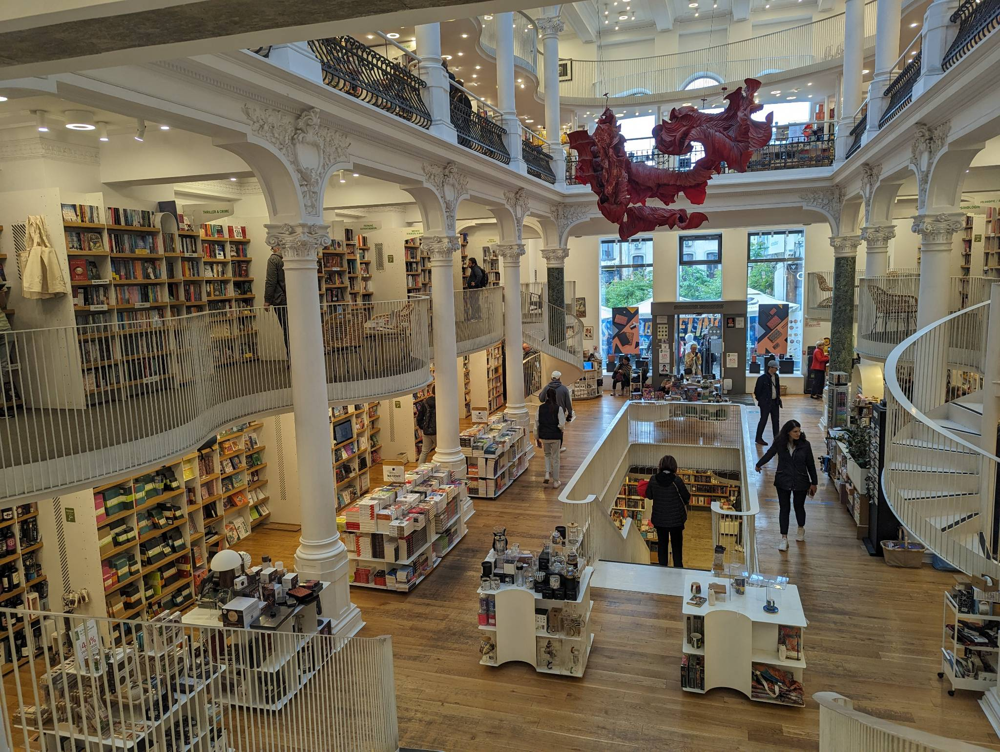

Now outside the library, we headed towards the Stavropoleos Monastery. On our way there we were stopped multiple times and offered food and drinks - seems like we hit a tourist spot. But we craved other food - not grill or kebab. So we passed them as quickly as we could. The monastery is home to the largest collection of Byzantine music books in Romania. It is an Eastern Orthodox Church with a distinctive architectural style. I found these types of Romanian churches really interesting. The use of both wood and stone gave the buildings a warmer feeling compared to the stone castles and palaces I had seen before. And then came time for lunch.

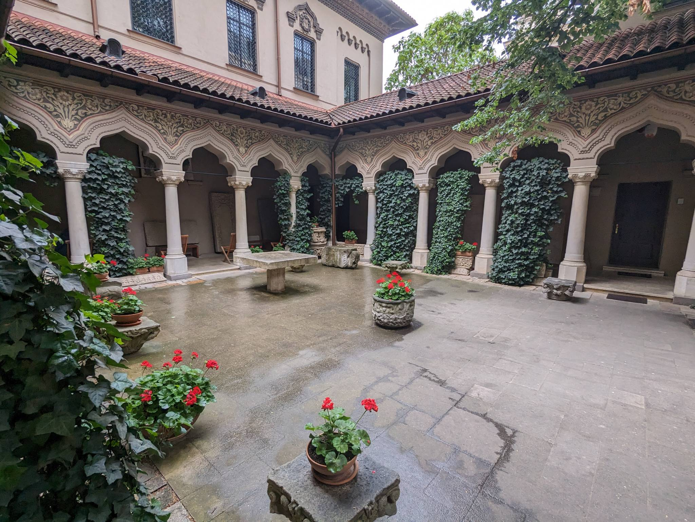

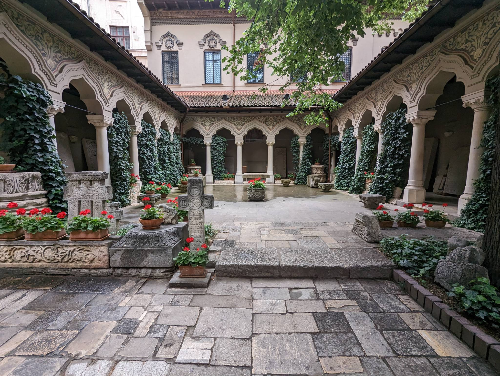

We found a well-rated Argentinian restaurant on Google Maps. We all wanted something different, so we picked this restaurant. They seemed to have quite a big selection. Well, the food certainly was good. I ordered beans with sausage. I thought I would get a something similar to *prebranac* (basically baked beans with bacon and other toppings). But it was more like a soup with beans and a sausage. It was quite tasty, I would rate it 4 out of 5. The prices were also quite normal (but later on, we found a restaurant that was like twice as cheap). But here comes my problem with this restaurant. When paying the bill, I didn’t really pay attention to the receipt. The total price seemed right so I just payed without asking anything. But later on, when we were dividing expenses among us, something seemed off. There was an unexplained cost of 32 RON (6,4 EUR). I wan’t sure what this was, so I used Google Translate. And it turns out, that this was a tip. But… I didn’t tip the waiter. This is not customary in Slovenia or pretty much anywhere else in Europe. Sure, you CAN tip, but you are either asked or it is voluntary. But here, the tip was added without asking or anything. The waiter didn’t ask anything, nor was there any warning on the payment terminal. Well, a lesson learned I guess. It was just 6 EUR, so we didn’t bother, but to anyone travelling to Romania, be careful, you might get tipped without being asked (it happened twice to us). Oh, and I forgot to mention, we had to wait for the food for a very long time pretty much everywhere we ate. So in conclusion, the food is very tasty, the prices range from cheap to normal and you might have to pay a tip if you are not careful. And just to be clear, I think tipping is a good thing, but it shouldn’t be mandatory - it’s purpose is to award really good service, and we weren’t serviced well.

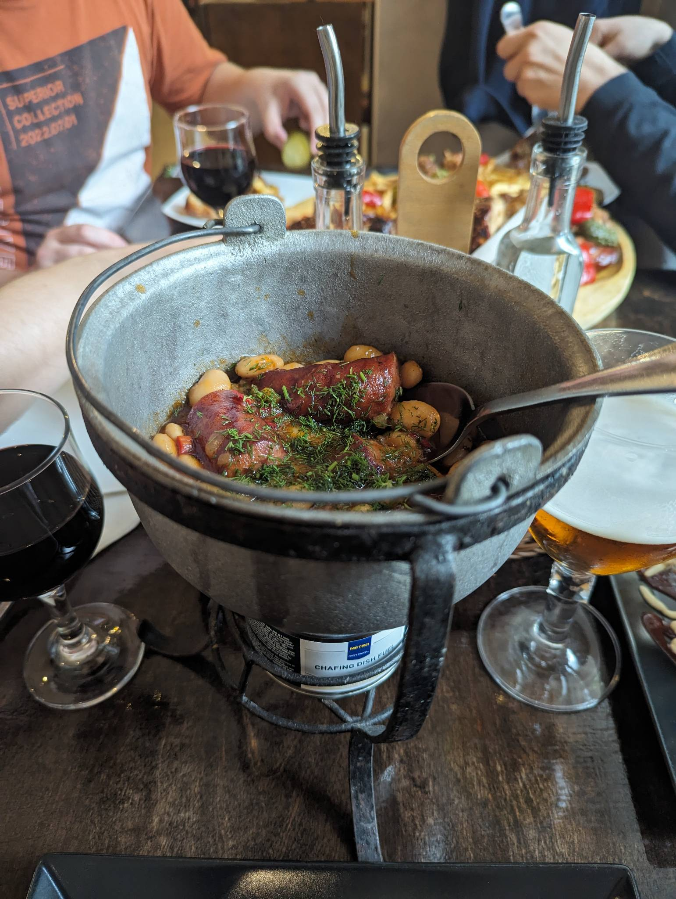

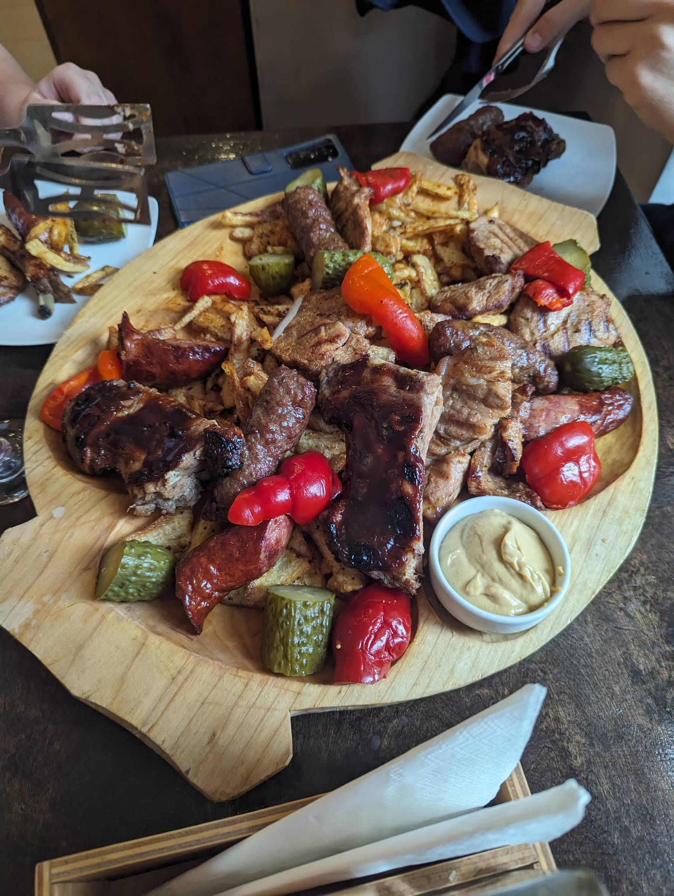

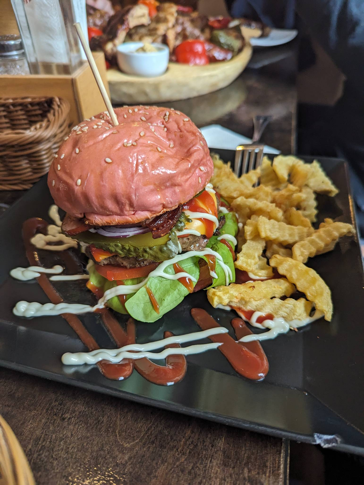

Anyhow, being a little bored, we decided to take metro to Arcul de Triumf - The Triumphal Arch. It reminded me of the Paris counterpart. Both share a rich history, with the Paris one symbolising French national identity and commemorates military victories and the Bucharest one the country’s heroes and milestones. Both are surrounded by a large multi-lane roundabout and are a great spot for photography. The metro ride to and from the arch was also very interesting. The trains looked modern - far better than the normal trains that we have seen on our road-trip, and the metro stations looked cleaner than many of the other stations that I have been to. Some were also quite modern, but on the other hand I sometimes felt like I was transported 50 years ago. The stations were also pretty windy, giving me a mild cold later on. The trains themselves were also not entirely wind proof and it was windy inside of the carriages themselves. Overall, I would rate this metro 3.5/5. I have seen better and I have seen worse. Though this is just my humble opinion, I am no expert on this matter.

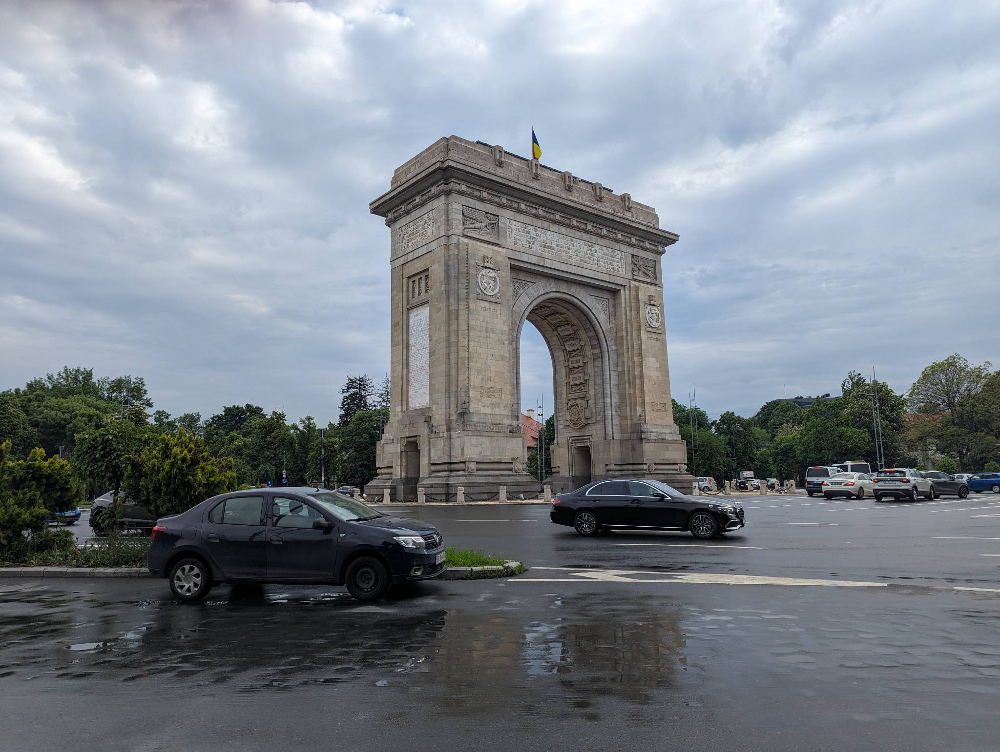

And this was pretty much it for day 4. The next day we visited the Peles castle. Peles castle used to be the summer residence of one of the last Romanian kings. I will let my friend finish this paragraph while I enjoy my shawarma at a diner in my hotel. Me and my friends went into the castle to look around. First, we were a bit worried about prices (we had seen prices ranging all the way up to 150 EUR), but it turned out, we paid much less for students tickets than we expected. Since we had to wait for castle personnel to let us in, i went and buy myself kinder bueno. I bought the white one, my favourite flavours. As we entered the castle, I realised, that this castle will be my favourite castle by far. Every room was unique, with styles hailing from disparate parts of the world, such as Turkey, Moorish kingdom, Macedonia, Bulgaria, Donetsk People’s Republic and much more. I wanted to buy some souvenirs from that overpriced Romanian souvenir shop, but later I decided not to. Me and my friend went out of the shop to wait for other friends to arrive. In the garden, there was a statue of the lady, who painted the whole castle. Me and my friend than decided, that we were too tired to proceed to the pond, and let others to take a look at it. After some procrastination, we proceeded to caught up with them.

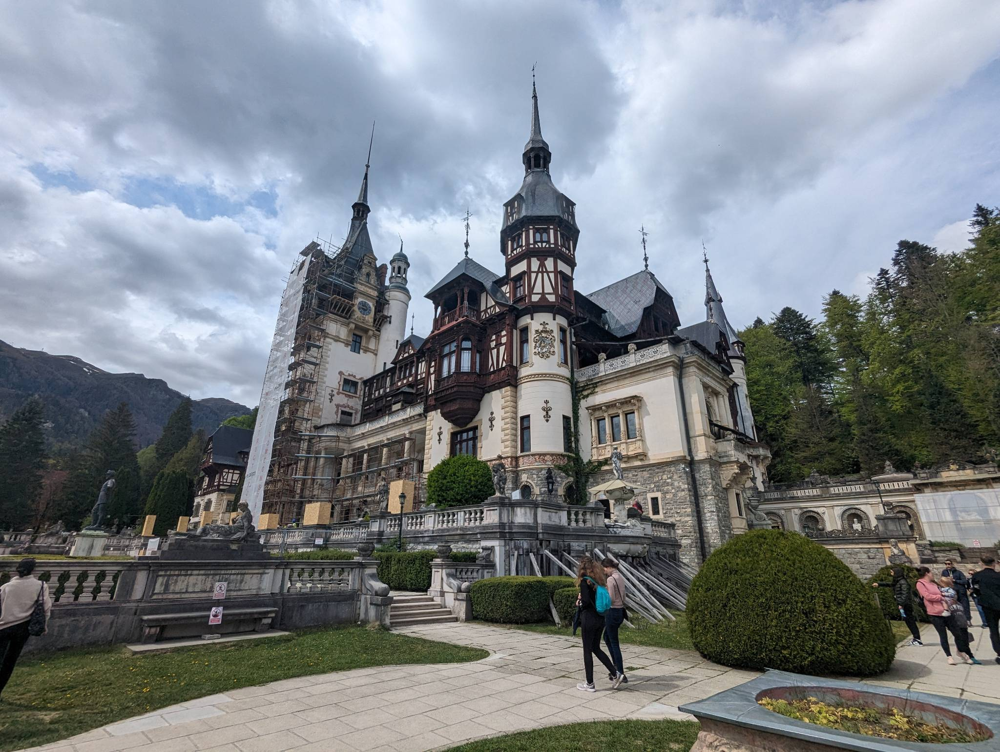

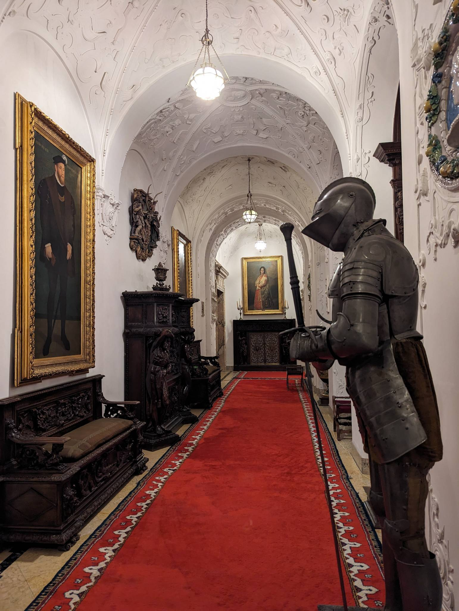

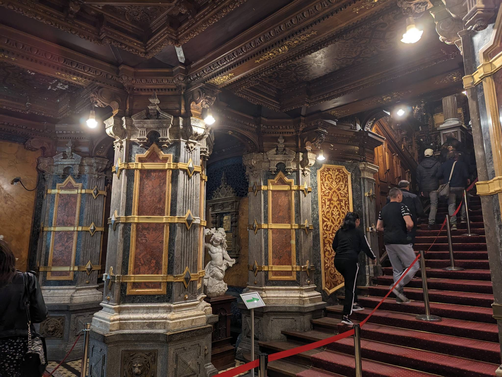

The rest of our time in this small city was spent visiting the various stalls with baklava, alcoholic drinks, diary products, handicraft and much more. We each bought something to bring home. I bought a marmalade, my friends bought some baklava. Soon after we left for Brasov. We spent the evening in Brasov. We ate some food at a diner named Dracula. We didn’t have high expectations given the previous experiences. But disappointed we were not. I ordered *sarma*, a traditional Romanian dish that is also often eaten on the Balkans. It is quite a simple dish - just minced meat (with rice) wrapped in cabbage leaves and cooked in a tomato based sauce. It was one of my favourite dishes that I haven’t tasted in a while. The food was served fast and it was delicious, the prices were good, and we weren’t scammed. I was pleasantly surprised and my evening was made better! This was the conclusion of the two days.

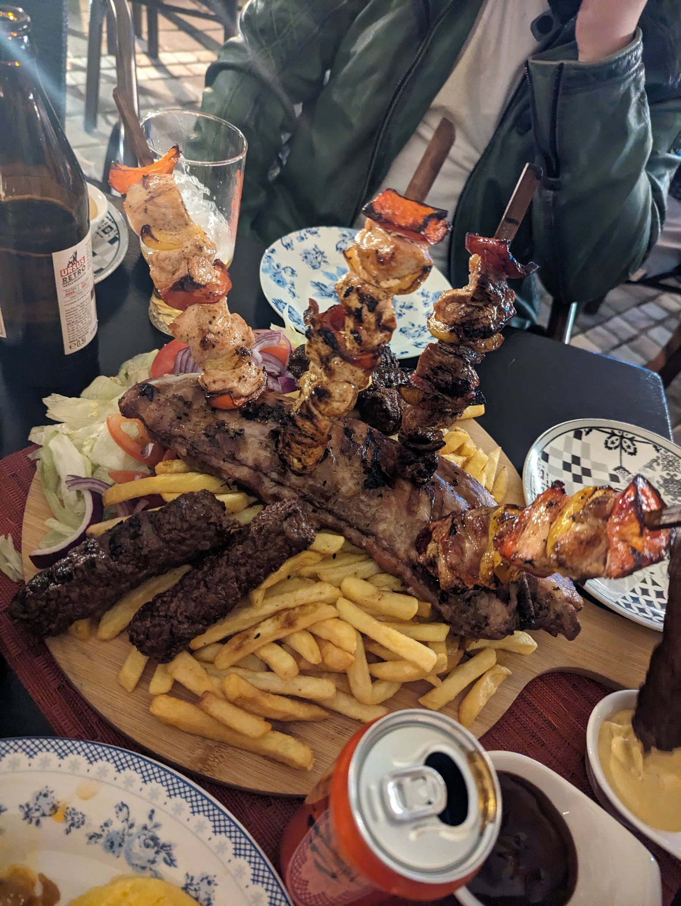

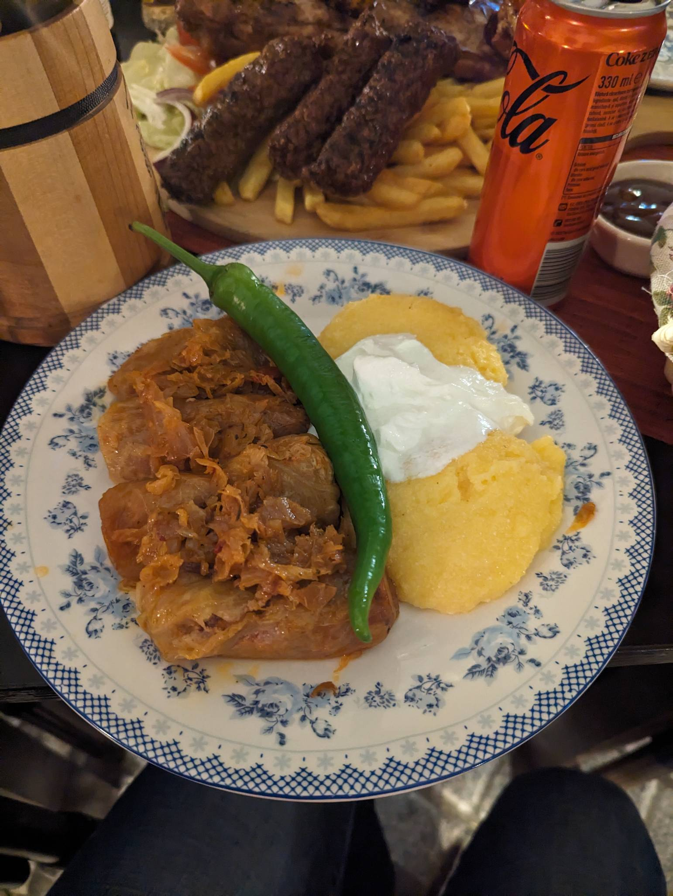
