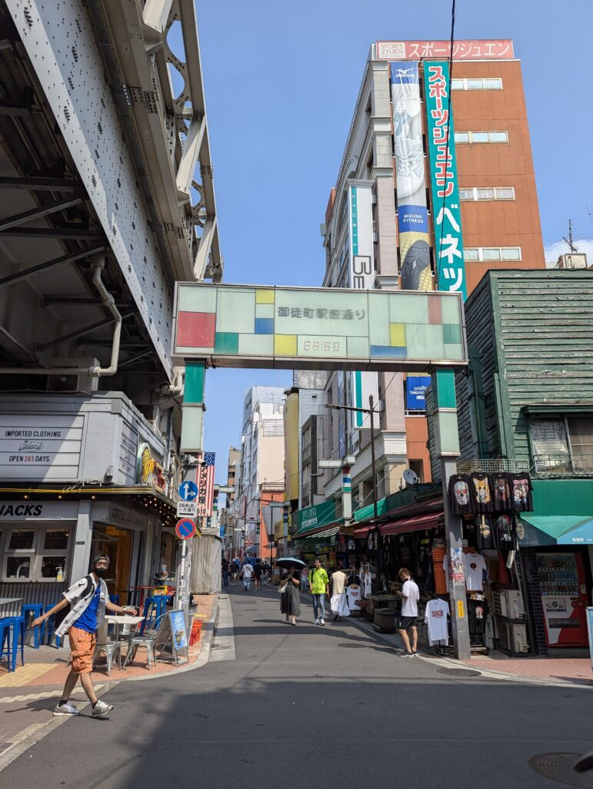
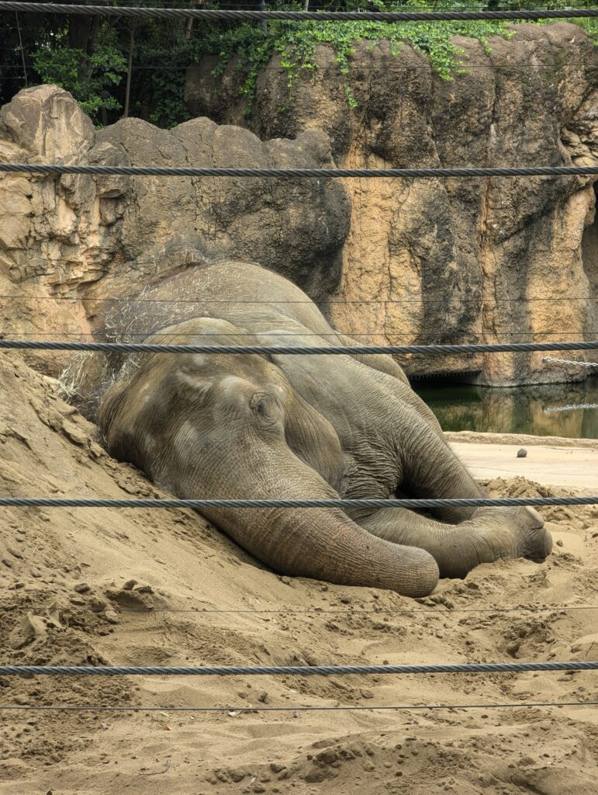
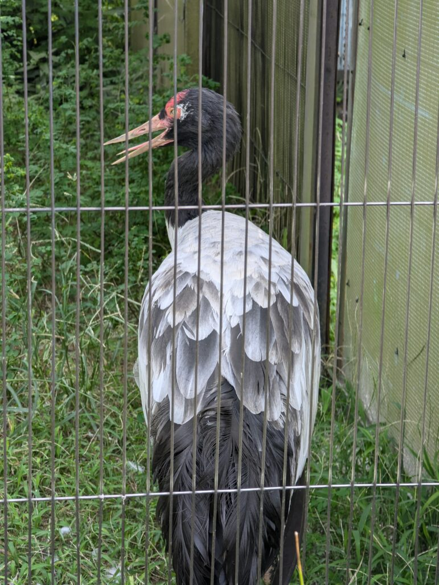
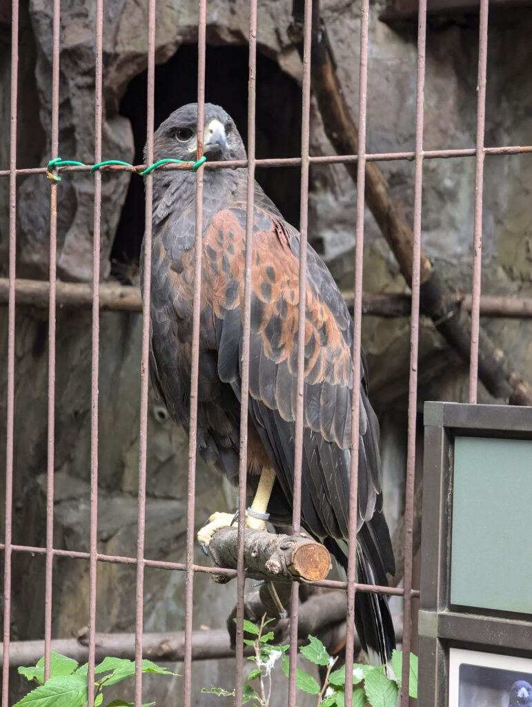
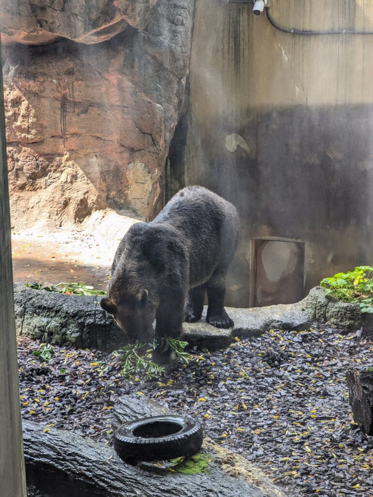

The last day in Tokyo has come. Again, we woke up without a proper plan in our mind. We just thought it would be cool to go to another park. Thus we headed towards the Ueno park, one of the biggest and busiest parks in Tokyo. And so, after leaving our Airbnb and taking a short ride on the Tokyo metro, we arrived at the Okachimachi station.

Okachimachi is a bustling shopping street near Ueno park. The name Okachimachi means “respectfully walking town”, but don’t be fooled by its name. This part of Tokyo is full of izakayas, resturants, shops and food stalls. It’s full of people looking for a bite of food or a new dress. Thus you can also find a lot of clothing and other various shops selling all sorts of souvenirs and other goods. We decided this place had a really good selection of food and that we would later get some lunch here.

*Okachimachi street*

But we did not linger around here for too long - for the smell of the food was really strong and we weren’t hungry just yet. Thus we continued onwards, towards the Ueno ZOO. The Ueno ZOO might be the most popular ZOO in Tokyo simply because of its great location. It is located next to several metro stations and its size makes it a great place for afternoon strolls. The entry fee is also very low - 600 JPY. You can see as many animals as you want and for as long as you want (until the ZOO closes at least). The ZOO has a large variety of both domestic and foreign exotic and other animals. This includes all sorts of monkeys (including the Japanese macaque), asian elephants, polar bears, seals, various birds (parrots, vultures, eagles, and other birds), rhinos, giraffes and so much more. The park also hosts several pandas. And a fun fact about pandas. All of the pandas of the world are the property of China and leasing a panda to another country can cost upwards of 1 million USD. Additionally, any cubs born to these pandas are the property of China. You learn something new everyday.

And this day is slowly coming to an end as I am writing this from the Takeshiba port in Tokyo. What am I doing at the Takeshiba port? I will be taking the overnight ferry to the island of Izu Oshima. This trip to an island will be a break from the Tokyo crowds and allow us to recharge our batteries. Though I am not so sure about the second part. The overnight ride might not be so comfortable. Though I do hope to get at least 5 hours of sleep.
