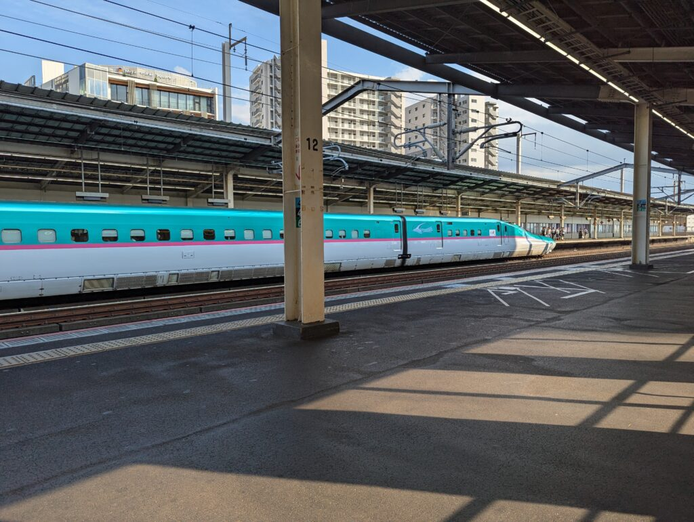
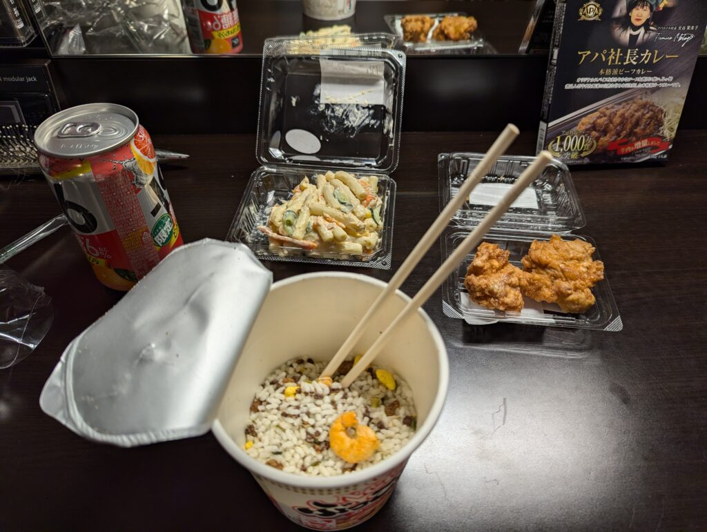
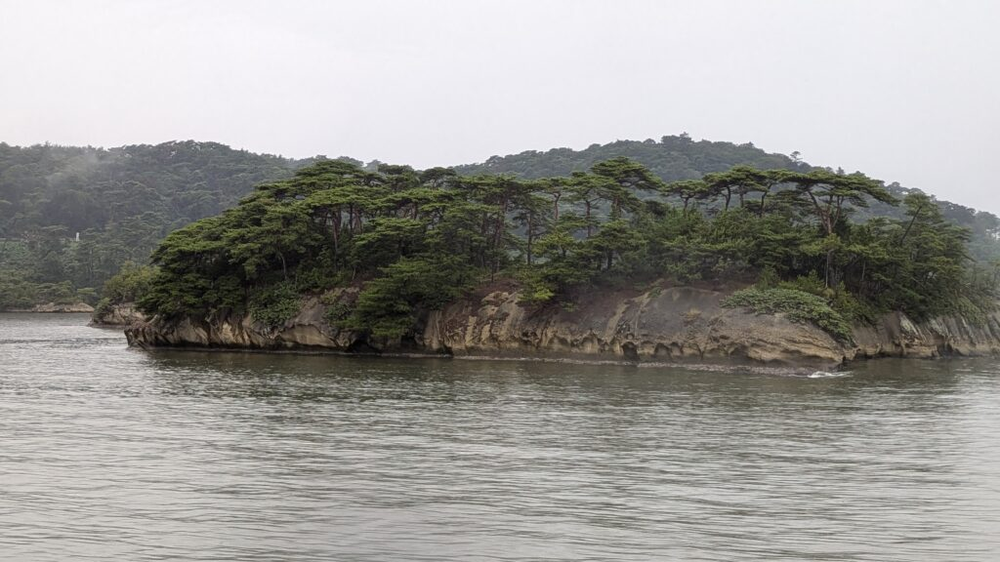
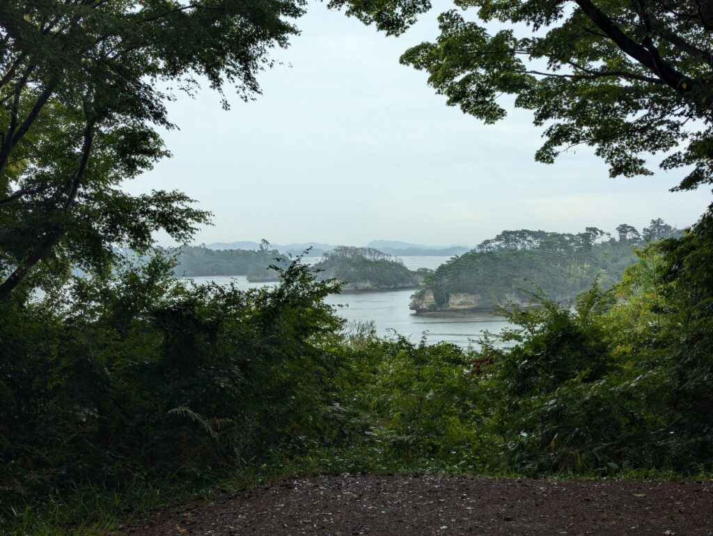
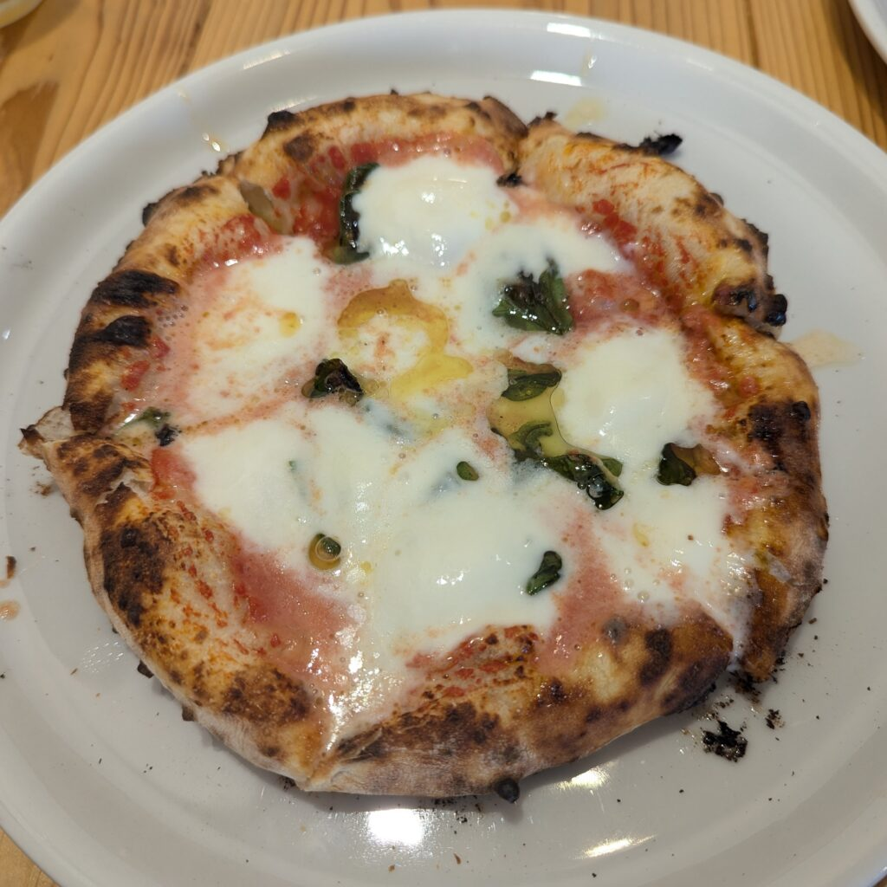
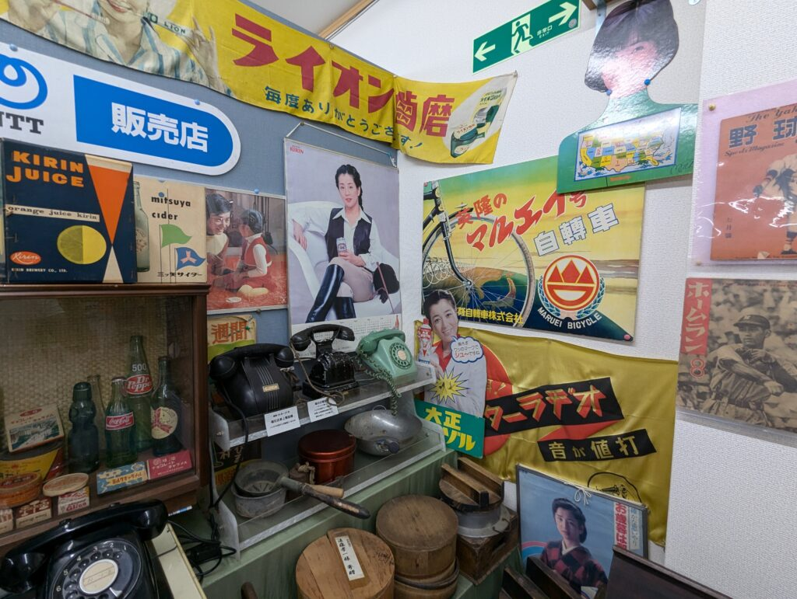

The time has come again for me to use the Japanese HSR (high-speed rail) network, also commonly known as Shinkansen (bullet train). My first destination on these super fast trains is Fukushima - the place mostly known for its nuclear disaster in 2011, when the Fukushima reactor melted as a result of one of the strongest earthquakes in the history of Japan.

The train that I used this time is named Yamabiko and it connects the cities of Tokyo and Morioka (the line extends to Hakodate, and it will be expanded to Sapporo in the future). This line is also refered to as Tohoku line. It is currently the fastest HSR line, reaching speeds of up to 320 km/h, only beaten by the Chinese Shanghai maglev train (though I also read there is a German ICE train that can reach speeds faster than 320 km/h). Also note that there are other HSR trains (such as the French TGV) that can reach such speeds. The Chinese maglev however still holds the record by a mile - reaching speeds of up to 460 km/h. Do note though that maglev is not a traditional train with wheels but rather it floats in the air using magnets. Look up how a maglev works if you don't know, it is really cool! Riding HSR trains is one of my favourite activities. When (maybe) travelling to China next year, riding the maglev is one of the things on my bucket list for sure. Oh, and when talking about these speeds, I am referring to their operational speeds. If we are talking about prototypes, then I think the Japanese maglev holds the record at 603 km/h.

One of my favourite things about the Shinkansen is the politeness and professionalism of the staff. The trains are also super clean, quiet and the ride is very comfortable. There are no bumps on the tracks and I would describe riding these trains like flying an airplane that has no turbulence and accelerates very slowly. A slight acceleration at the start and an occasional increase or decrease in height of the tracks which results in that momental feeling of weightlessness that makes some people dizzy. But even my friend who had it really bad on the airplane did not complain about this, so I doubt anyone would get sick from riding this (or similar) trains.

Also worth explaining is the fact that we purchased a JRPass, which gives us unlimited rides on bullet trains and any other JR operated local and express lines. The JRPass got a lot more expensive since october last year, but using an online calculator I figured buying it is still worth it for me. If you are planning on buying a JRPass or have any questions about public transport in Japan, I invite you to check out one of my posts about this topic: <a data-id="https://davidblog.si/2024/02/17/things-to-remember-when-travelling-to-japan/" data-type="link" href="https://davidblog.si/2024/02/17/things-to-remember-when-travelling-to-japan/">Things to remember when travelling to Japan</a>.

To conclude my speech about high-speed trains, the ride from Utsunomiya to Fukushima took 43 min. The entire ride I was mostly just observing the nature around us and wishing we had such trains in Slovenia. Appearently there are some plans to build a HSR line between Ljubljana and Maribor in the future, but this likely won't come any time soon. Thus I embraced the reality of today - HSR in Japan, no HSR at home :(. At the very least I just need to go across the border and I can use HSR there.

*Yamabiko (E5 series shinkansen)*

Now back to Fukushima, where we arrived later in the afternoon. Given the fact we had spent half the day in Nikko we didn’t have much time left in Fukushima. Only an evening and that was about it. We decided we would go for an evening stroll. No destination in mind, just walking around a little bit until we found something interesting - such as a shopping centre, a shrine or anything similar. After walking for a bit I opened Google maps to check our location. And I saw a spot on the map that seemed to be crowded (for those unaware, Google maps has a feature that shows you spots where large groups of people are located). And I thought it might be interesting to go there. The crowded spot proved to be a big shopping centre. With nothing better to do, we walked into one of the shops - a potentially costly decision. The shop had so many items we just could’t resist buying some snacks, a sudoku and a couple other things. Everything was super cheap, 100 JPY for almost every item we bought. The next destination was a supermarket. Yet again, decisions were hard to make. Wa wanted to buy something for dinner, but there was simply too much to choose from! Tenpura, ramen, onigiri, karage… Anything and everything. But after some careful consideration I decided to buy a salad, some karage, a cup of ramen and an orange flavoured fuzzy drink. It wasn’t a Michelin starred dish, but I was pretty happy with it.

*Supermarket dinner (and Fumiko Motoya's curry in the background)*

The next day it was decided we would go on a day trip to the town of Matsushima. Matsushima, as its name implies, is a place with lots of islands. The “matsu” in Matsushima means “pine” - as most islands are covered with pine trees - and “shima” means island. The Matsushima bay consists of over 260 small islands, each with its own story and history. One of the stories that I remember is that of the island named Senganjima. In the time of Date Masamune, the founder of city of Sendai, lord Date also went on a sightseeing tour just like us. He too was impressed by this island. And thus he offered a large reward to anyone who could bring a rock to his palace from this island. The name of the island comes from the amount of money that lord Date offered. A lot of other islands have such stories. Another interesting island is a human like island (it doesn’t look like that to me, but that is how it was described) that apparently protects the bay from tsunamis and other danger. Some of the islands were described as feminine and others as masculine. I didn’t see this resemblance either, but I appreciate the interesting stories about these islands. The cruise around the bay that we took later described all the islands in such a way. And since I am sure the reader wants to know more about the islands, <a data-id="https://www.matsushima.or.jp/en/course/" data-type="link" href="https://www.matsushima.or.jp/en/course/">here is the link to one of the cruises that goes around the bay.</a>

*One of the many islands in Matsushima bay*

However, before going on a boat cruise, we visited the main attraction of Matsushima - the Fuukurajima island, which is accessible via a small pedestrian bridge. The bridge is around 250 meters long and the entry fee was 200 JPY. The bridge is painted red and you can take some really cool looking photos from it. The only unfortunate thing is that it was raining and we needed an umbrella. As a matter of fact it was raining a lot. And it started raining more and more with every minute. I had already thought we have avoided any bad weather but sadly not. Statistics don’t lie - September is one of the rainiest months in Japan… Though this didn’t stop us from exploring the rest of the island. Sure our shoes were soaking wet at the end of the day (though I had it better with my low-profile hiking shoes) but the rainy weather made for an interesting ambience. Last year when I came here it was sunny and the different weather was something novel this time around. The small island was full of forest paths and cozy places to rest. In the middle of the island was a small cafeteria where we could treat ourselves to a dessert. We bought a snack called “dango”. Dango is a Japanese rice dumpling - sort of similar to a mochi but with no filling. It is slightly sweet. This dango was covered in a sweet miso sauce and then grilled. This gave it an interesting taste - something not everyone might like, but it was quite to my liking. And since I was still craving some food I also ordered myself a matcha ice cream. Once again, I liked it a lot :).

*The view of the bay from the island*

And after this came the boat cruise. This is also when it started raining the most - just as we were waiting to board the boat. Soon after it also became windy, which was simply excellent. We just couldn't get any more wet. By the time we boarded the boat we were both completely soaked. But at least we were finally under the roof. The wind also improved the sailing experience. As soon as the boat exited the bay, large waves came and I felt like I was riding a rollercoaster. It felt almost like sailing though the Drake passage (look it up if you don’t know what this is). But to put it shortly, this is a passage between South America and Antarctica and it is known for some of the harshest weather on the sea. One time I even heard a couple of people scream a little bit and a couple of bottles falling on the ground. I on the other hand really enjoyed the experience and wished we would hit an even bigger wave. I love some adrenaline.

The day concluded with a lunch/dinner and a visit to a retro museum. The pizza restaurant had a funny name. It felt almost out of place, as if I was going to one of the restaurants on the Croatian, Slovenian or Italian coast - Pizzeria Pino Isola Vesta. What a mouthful, and what does the name even imply. Let’s do some thinking. This is a pizza place so we should probably start with the fact that this is Italian. Pino in Italian could either be a name or a pine tree. In the context of Matsushima I would guess the latter. Isola obviously means an island. And Vesta is the Roman goddess of home, hearth and family. Suddenly the name makes sense. Pino Isola - that would be Matsushima (as explained before) - and Vesta - to make one feel like at home. Are the owners Italians to have thought of such a name? Most likely not, but I appreciate the effort to come up with this name in any case. The pizza here was the Napoli style pizza - which is how I prefer my pizza to be made. I of course ordered the mozzarella pizza, which was made out of local milk. The pizza was pretty good, probably the best I have had in Japan. However, it doesn’t beat any other Napoli pizza that I have had at home or in Italy. Pizza here in Japan just isn’t on that level - or perhaps I am just not accustomed to how they make pizza here. Non the less, eating some European food after a long time felt pretty good.

*The pizza had a LOT of cheese*

The retro museum on the other hand was very unique. It was full of antics from even the previous century: old phones and TVs, cassettes and posters, and there were also many old toys that you could try. Among them was also a pachinko machine that still works perfectly. I spent quite some time at the machine and started to understand why some people were so addicted to it. You inserted some metal balls and hoped that the balls would fall inside the prize holes. You could control the fall to a certain degree, but luck was the determining factor for the most part. If you managed to hit the holes, you received a reward - even more metal balls. In the real world, these metal balls can then be exchanged for rewards. Pachinko sort of a replaces the low-stake gambling commonly found in western casinos - such as slots. Some people might wonder how such a game is even played if gambling is illegal in Japan. But this is yet another loophole that is exploited to get around the rules. Since gambling for cash is illegal, the pachinko balls can be used to buy special rewards - something like tokens. However, there is one big catch. The tokens are exchanged for cash off-site and voila - you have just legalised gambling without breaking any rules. But aside from pachinko, there were also many other artefacts that reminded us even of our childhood. Especially the old dial-up phones and CRT TVs.

*Lots of posters, old dial-up phones etc.*

We arrived home pretty late. It was a fun day but we were completely soaked. Thus the only logical thing that followed was taking a shower. I on the other hand once again headed straight to the hotel onsen to relax a little bit.
