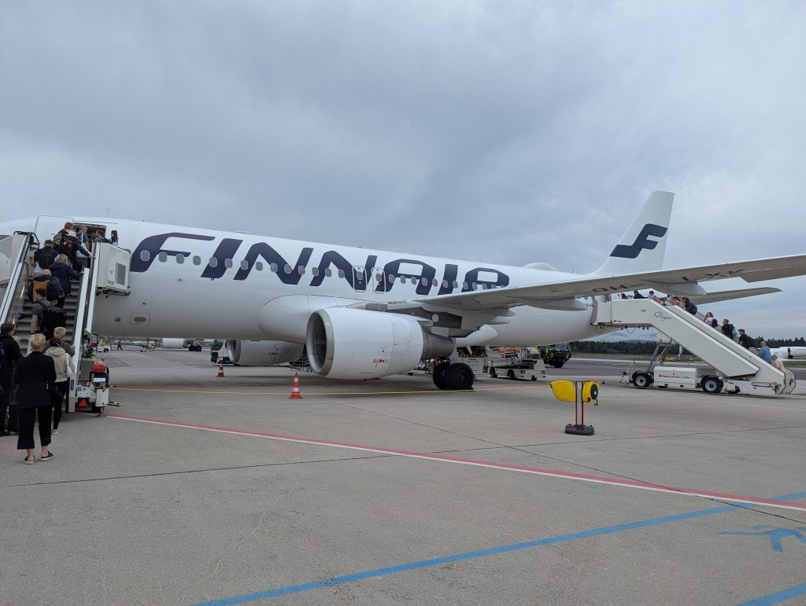
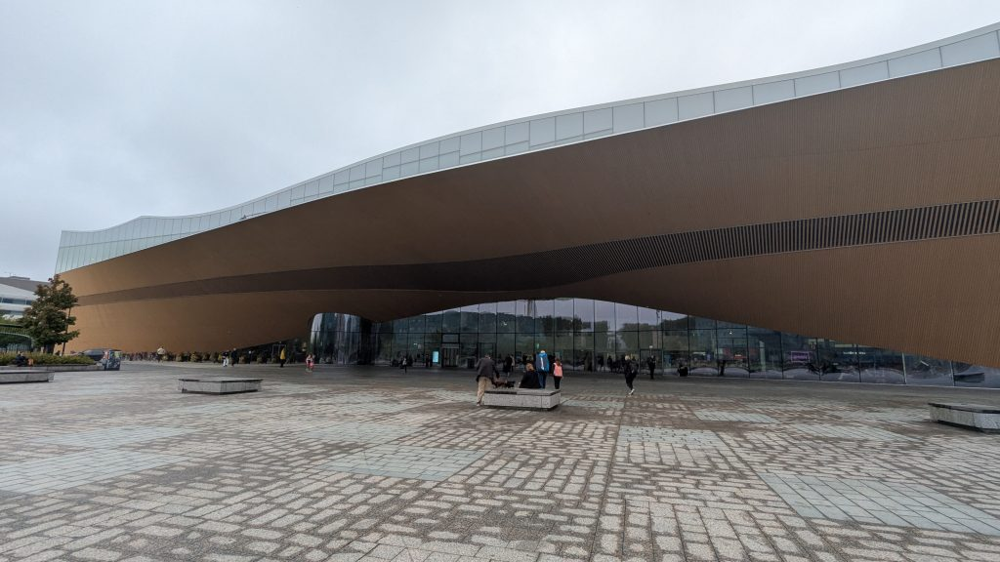
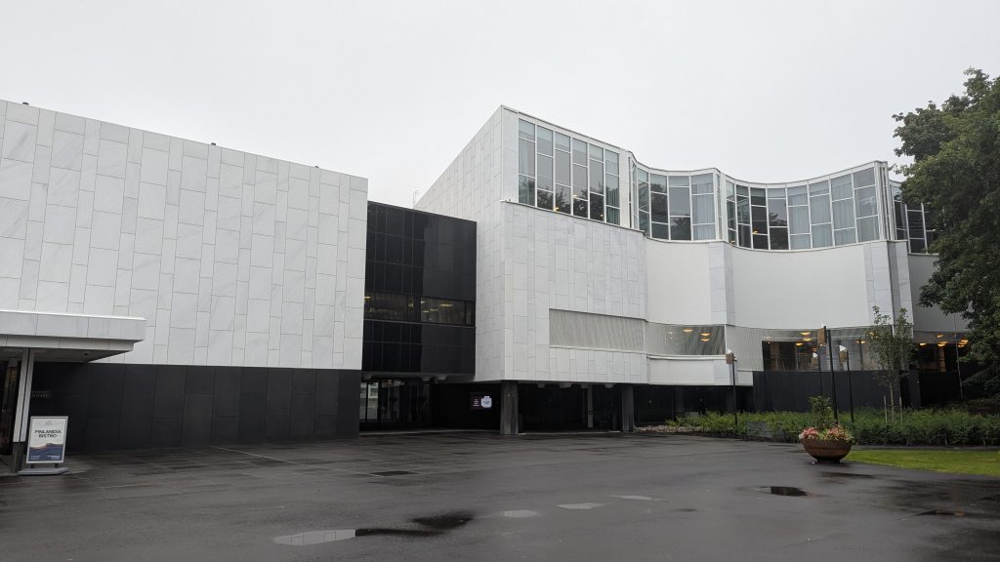
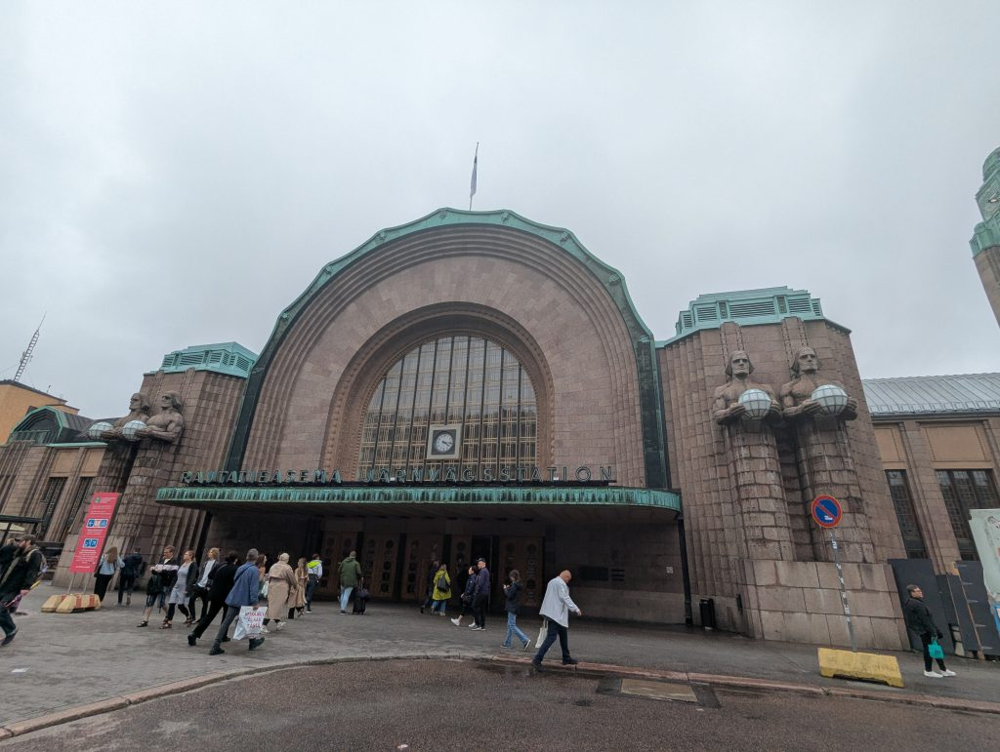
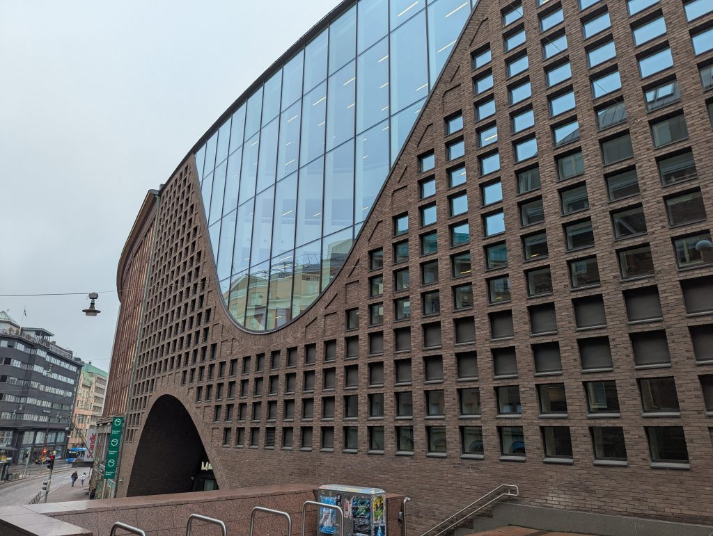
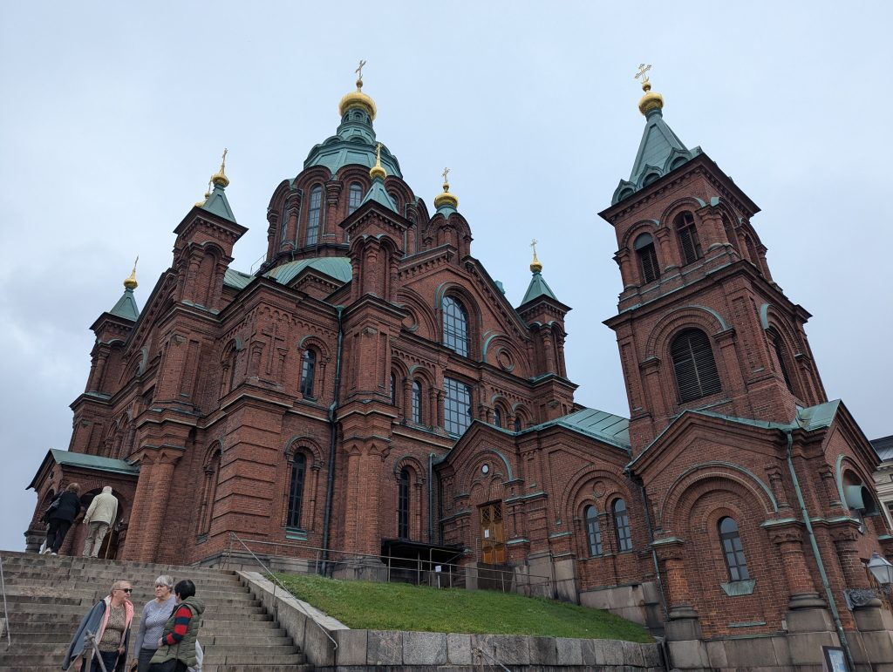
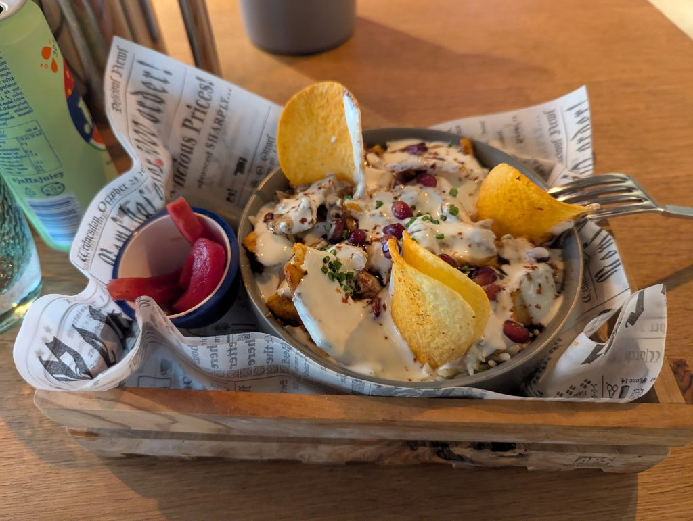

Finally, vacation is here. My trip to Japan has finally begun. And the first step is getting to Japan. Even though I purchased the plane ticket quite late, I managed to get quite a good deal!

A flight from Ljubljana to Nagoya for just 780 EUR, with a roughly 12 hour stop in Helsinki. Usually, I would prefer my layovers to be shorter than 4/3 hours. But! Since it is Helsinki, and I have never been to Helsinki before, and have wanted to visit it someday anyways… I decided I would spend the layover time exploring the city. And I have to say, this was a really good decision!

I am writing this post from a lovely cafe near the train station with a sort of Cuban vibe. Quiet jazz-ish and pop music, people enjoying their coffee and deserts, and the basement part where I sat down is amazing. Slightly dimmed lights so you get a sense of privacy, just perfect for writing a post about my trip. 

Well, about today, I saw a couple of things. I did not really get a feeling that Helsinki has a lot to offer from a historical perspective. Surely, a history geek will find a lot here, but I am not one. The city itself though is really nice. It feels very liveable. A perfect mix of calm and entertainment. As I walked through the city there were many parks where you can sit down and relax. However, there were also many street performers playing (what I assume) traditional music. There was a lot of street food at the food market, but there were also many fancy restaurants. Just, really, a great balance. I would totally see myself living in a city like this. Quiet time during the week, party time during the weekend!

What I also find amazing is that everyone speaks fluent English - something that is not common across a lot of Europe, even less Asia. I also heard a lot of people speaking English, and even some German. The city has a multicultural vibe to some extent, which I really enjoy.

As for the architecture - there are a lot of modern building. Fans of modernist architecture can find many amazing looking buildings here. I noticed that most building employ a lot of natural materials - stone, marble, wood and bricks were the most common materials for new buildings it seemed. Add to this large windows and you get a really slick, modern style that does not feel like a concrete jungle. It is also nice that there are not that many flats and pretty much no skyscrapers. It is mostly just multi storey buildings. I would also like to add that many parts of the city had a similar vibe to Vienna - especially with those bourgeois buildings.

One of the modern buildings was the Oodi library - a huge wooden and glass structure full of entertainment, but also quiet spaces, and at the same time a true multicultural hub. There is library full of English and Finnish books, a cinema, a cafe and a restaurant, gaming and working rooms to borrow. There is also an area with a workshop, where you can print things, sew your clothes, and much more. And get that, you can even borrow instruments and a studio to play them with your library card. A building full entertainment and culture - I would love to see something like this, at this scale, be built in Slovenia. 

Oodi library:

There were also a lot of really interesting looking churches, a really nice university, train station etc. Instead of describing all of them, I will just add some pictures below!

Regarding food… At first I wanted to get some traditional salmon soup, maybe even a whole menu. I found a nice rustic, traditional place, that was recommended on reddit by the locals… And the menu looked great! Tasting local dishes has always been how I do my trips. Unfortunately, as soon as I saw the price tag on the menu, I turned around and looked for a cheaper place. 61 EUR for a menu, and 28 EUR for a large salmon soup. Kinda expected, but too much for my budget. Perhaps next time if I visit Helsinki again. Instead, I went to a Syrian/Arabic fusion restaurant and ordered a Fatteh bowl. The dish was made of that nicely aromatised Arabic rice, yoghurt, chickpeas, pomegranate and chicken. As well as appropriate seasoning. This is probably one of my top 10 dishes to try. A perfect mix of sweet, sour, umami - a bit of crunch and a bit of gooeyness from the yoghurt. This and a drink cost me 23,90 EUR, which is quite more expensive than Ljubljana, but still in reach of a student’s travelling wallet.

I will wrap this day up by saying that I will most likely be writing a post every two days or so, but keep it short. 30 min of writing a day and a quick proofreading is the maximum amount of time I want to spend on these posts. After all, last year, I figured that writing a post every day was too much after a long tiring day. Sometimes when I get back from exploring the city, I just want to go to an onsen, relax, watch an episode of anime and then go to sleep. Maybe hit a 7/11 before that, but that is about it.

And that will be all for today. I am getting really tired, so I will add a couple of images, go for another stroll and then head back to the airport. And then… then 12h flight that I am really not looking forward to. But I have to endure - for at the end of it awaits another great adventure!
